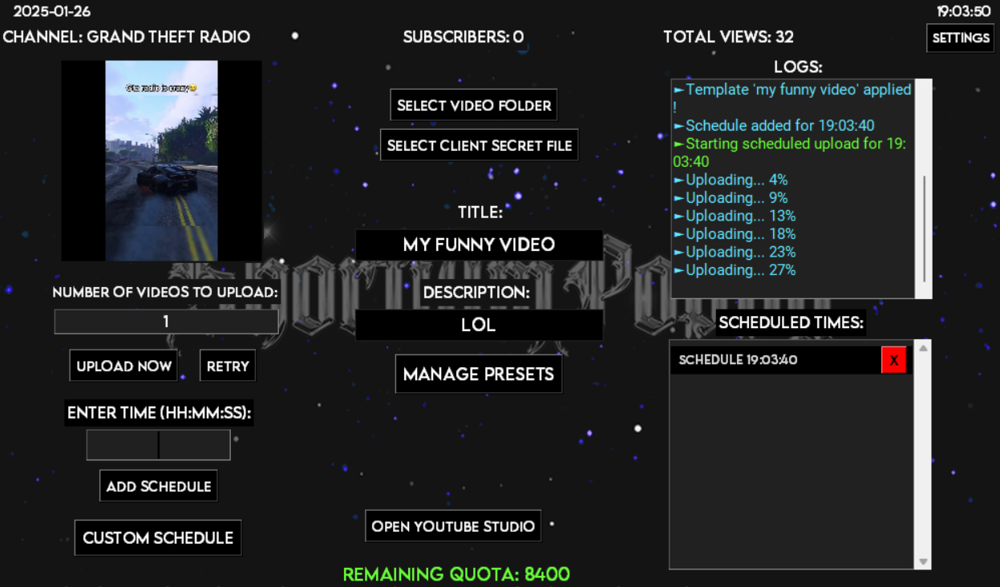
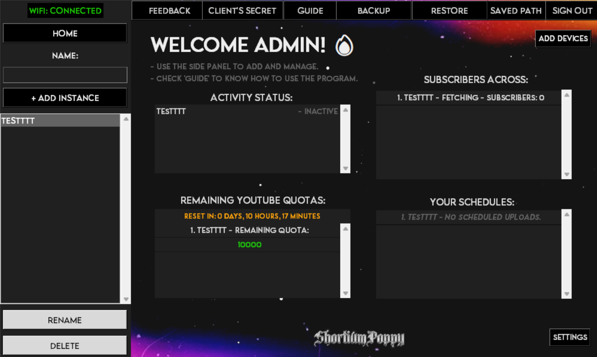
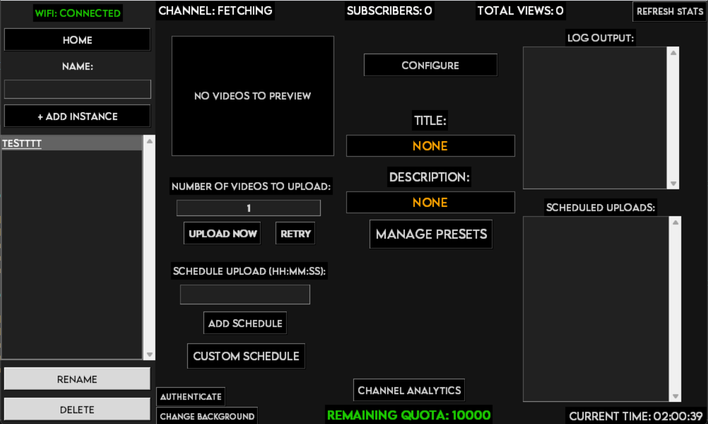

# ShortiumPoppy Automation Program (Lite Version)💫

This program is designed to help you automate YouTube video uploads with advanced scheduling, template management, and custom features. It's a lightweight version with essential functionalities for managing your YouTube uploads efficiently.

---

## **Features🎉**
- Add, edit, and manage templates for video titles, descriptions, and tags.💖
- Assign specific videos to templates for automated uploads with predefined metadata.🚀
- Schedule video uploads at specific times with optional custom templates.🤖
- Track remaining daily quota and reset it automatically at user's local time.👨‍💻
- Video preview feature for easy selection and scheduling.💫
- Dynamic UI for managing templates and schedules with scrollable lists.🌌



---

## **Prerequisites💻**
1. **Python Version**: Ensure you have Python 3.9+ installed on your system.
2. **Required Libraries**:
   - Install the dependencies listed in `requirements.txt`:
     ```bash
     pip install -r requirements.txt
     ```

---

## **How to Run🏃‍♂️**
**Run the .exe file attached.**
OR
1. Clone this repository to your local system:
   ```bash
   git clone https://github.com/v43ky/ShortiumPoppyLite.git
   cd ShortiumPoppyLite


Install dependencies:

   ```bash
   pip install -r requirements.txt
```

## **Run the program:**
   ```bash
python shortiumpoppy_lite.py
```

---

## **How to Use🤩**

1. **When you run the Program, the Directory and folders everything will be created in your Documents Automatically!🥰**
2. **Create a Client Secret file.🎉🔥**
3. **Link folder Containing Videos.😎**
4. **Start Upload Automating!🔥🔥**

## **1. How to Get Client Secret file🤔💭**

Watch this video [https://www.youtube.com/watch?v=v6YEZC6XX2g] Or read the Guide Below!

**Go to Google Cloud Console.🤪**
- [https://console.cloud.google.com/]
- Sign in with your Google account. 
- Click on New Project and create a project (you can name it anything).
- Enable the YouTube Data API
- In the left-side menu, hover over APIs and Services and click Enabled APIs and Services.
- Click on Enable APIs and Services.
- Search for and enable YouTube Data API v3.
  
## **Set Up OAuth Consent Screen💨**
- In the left-side menu, click on the OAuth Consent Screen.
- Select External as the user type and click Create.
- Customize your app name and enter:
- Your Google account email is the User Support Email.
- Your personal email in the Developer Contact Information.
- (Optional) Skip adding additional details like icons or addresses.

## **Add Scopes**
- In the Scopes section, scroll down to Manually Add Scopes.

## **Add the following scopes:🚀**
```
https://www.googleapis.com/auth/youtube.upload
https://www.googleapis.com/auth/youtube.readonly
https://www.googleapis.com/auth/yt-analytics.readonly
https://www.googleapis.com/auth/youtube
https://www.googleapis.com/auth/youtube.force-ssl
```
- Click Update and Save and Continue.

## **Add Test Users🤖**
- In the Test Users section, add your Google account email (the one associated with your YouTube channel).
- Click Save and Continue.
- 
## **Create OAuth Credentials🔐**
- Go back to APIs and Services > Credentials.
- Click + Create Credentials and select OAuth Client ID.
- Choose Desktop App as the application type and name it anything.
- Click Create.
- Download the JSON File

**After creating the credentials, download the JSON file.🔥**
- Use this file in the program by selecting it through the Select Client's Secret File option in the UI.
- 
## **Tips and Notes📒**
- Repeat this process for all additional channels you want to manage.
- Complete the authentication immediately after selecting the client secret file.
- If you see a warning that the file isn't verified, click Continue to complete the process.
  
## **Final Step: Authentication🌟**
- The program will open your browser for Google account verification once the client secret file is uploaded.
- Complete the authentication process, and you're ready to start uploading videos!
  
---

## **2. ShortiumPoppy Features:💻🚀**

## *Templates💨*: 
- Create and manage templates for video titles, descriptions, and tags.
- 
## *Custom Scheduling🤖*:
- Schedule video uploads at specific times.
- Assign videos to templates for automated uploads with predefined metadata.
  
## *Quota Tracker💻*: 
- Track your remaining daily quota, which resets on user's local midnight time.
  
## *Creating and Using Templates🔥*:
- Navigate to the Manage Templates section.
- Enter the title, description, and tags for your template.
- Save the template and assign specific videos if needed.
- Use the "Use" button to select a template for future uploads.
  
## *Scheduling Video Uploads😜*:
- Select a video from your folder.
- Set the desired upload time in the format HH:MM:SS.
- Click Save Schedule. The video will upload automatically at the scheduled time.
  
## *Quota Management💸*:
- Quota is deducted for each upload.
- The remaining quota is displayed in the main interface and resets daily.

---
# 🚀ShortiumPoppy Automation Program - Complete Version (Launching Soon!)🔥🔥



---
## **Key Features of the Complete Version💸💸**
---

## Multiple Devices Integration🌟🔥:
- Based on Purchase, You can Copy and Run the Complete program in **MULTIPLE** PCs/Servers with your license file *(That you obtain via Email)* All At Once!🚀🚀
- Manage More than 25 Channels Automating Upload and Multiplying Your Success Rate!

## Multi-Channel Management🥳🥳:
- Allow users to manage multiple YouTube channels.
- Create Multiple Instances, Link them, and Manage them!
- Store separate templates, schedules, and quotas for each channel.
- Has Separate Chrome Instances for Each Channel enabling you to Check Each Channel's Analytics

## Enhanced Template Management🤯🤯:
- Group templates by channel.
- Allow bulk creation and assignment of templates to videos.
  
## Advanced Scheduling🌟:
- Set recurring schedules for weekly or monthly uploads.
- Add batch scheduling for multiple videos.
- Customize Scheduling for each Video to Specific times.
  
## Analytics Dashboard🧑‍💻:
- Show daily quota usage, Schedules, and channel performance stats.
- View Your Channel's Analytics in the Bot UI.
---


---

## **Contributing🥰🥰**
Contributions are welcome for the Lite version and the Complete version!
- Will launch Updated versions from Time to Time by your feedback!

---

## **License📁**
- Obtain the license file via the Email [shootashortservice@gmail.com] for the **Complete Version**, after it is Launched and Bought By You.
- **Lite Version** is Free To Use for All!

---

## **Contact🤙📞**
If you have any questions or need any help, please feel free to contact [shootashortservice@gmail.com].
